# Database Structure

## ER Diagram

```mermaid
erDiagram
    agent_providers {
        bigint id PK
        uuid uuid
        bigint apps_id
        string name
        string handler
        json config
        boolean is_active
        boolean is_deleted
        timestamp created_at
        timestamp updated_at
    }

    agent_types {
        bigint id PK
        uuid uuid
        bigint apps_id
        string name
        string description
        json config
        string handler
        string provider
        longtext role
        boolean is_active
        boolean is_published
        boolean is_multi_agent
        json multi_agent_list
        boolean is_deleted
        timestamp created_at
        timestamp updated_at
    }

    agent_models {
        bigint id PK
        uuid uuid
        bigint apps_id
        bigint agent_provider_id FK
        string name
        string model_name
        json config
        boolean is_active
        boolean is_published
        boolean is_deleted
        timestamp created_at
        timestamp updated_at
    }

    agents {
        bigint id PK
        uuid uuid
        bigint apps_id
        bigint companies_id
        bigint agent_type_id FK
        bigint agent_model_id FK
        bigint user_id
        string name
        string slug
        longtext description
        longtext role
        json config
        bigint company_task_list_id
        json workspace
        boolean is_active
        boolean is_deleted
        timestamp created_at
        timestamp updated_at
    }

    agent_tools {
        bigint id PK
        uuid uuid
        bigint apps_id
        bigint companies_id
        string name
        string slug
        string model_name
        text description
        json config
        boolean is_active
        boolean is_deleted
        timestamp created_at
        timestamp updated_at
    }

    agents_tools {
        bigint id PK
        bigint agent_id FK
        bigint agent_tool_id FK
        json config
        boolean is_deleted
        timestamp created_at
        timestamp updated_at
    }

    communication_channels {
        bigint id PK
        uuid uuid
        bigint apps_id
        string name
        text description
        string handler
        json config
        boolean is_active
        boolean is_published
        boolean is_deleted
        timestamp created_at
        timestamp updated_at
    }

    agent_communication_channels {
        bigint id PK
        bigint agent_id FK
        bigint communication_channel_id FK
        string entry_point
        json config
        boolean is_deleted
        timestamp created_at
        timestamp updated_at
    }

    agent_histories {
        bigint id PK
        uuid uuid
        bigint agent_id FK
        bigint companies_id
        bigint apps_id
        bigint users_id
        bigint company_task_engagement_item_id
        bigint message_id
        string entity_namespace
        bigint entity_id
        longtext context
        json config
        json external_reference
        json input
        json output
        json error
        boolean is_deleted
        timestamp created_at
        timestamp updated_at
    }

    agent_versions {
        bigint id PK
        bigint agent_id FK
        string version
        json config
        text changes
        bigint created_by
        boolean is_active
        boolean is_deleted
        timestamp created_at
    }

    agent_feedback {
        bigint id PK
        bigint agent_history_id FK
        bigint user_id
        integer rating
        text feedback_text
        boolean is_deleted
        timestamp created_at
        timestamp updated_at
    }

    agent_performance_metrics {
        bigint id PK
        uuid uuid
        bigint agent_id FK
        bigint agent_history_id FK
        bigint apps_id
        string metric_type
        float value
        timestamp period_start
        timestamp period_end
        boolean is_deleted
        timestamp created_at
        timestamp updated_at
    }

    agent_swarms {
        bigint id PK
        uuid uuid
        bigint apps_id
        bigint companies_id
        bigint users_id
        string name
        string slug
        longtext description
        string status
        json config
        boolean is_active
        boolean is_deleted
        timestamp created_at
        timestamp updated_at
    }

    agent_swarm_members {
        bigint id PK
        bigint agent_swarm_id FK
        bigint agent_id FK
        string role
        json config
        boolean is_deleted
        timestamp created_at
        timestamp updated_at
    }

    agent_machines {
        bigint id PK
        uuid uuid
        bigint apps_id
        bigint companies_id
        string name
        string slug
        string host
        integer ssh_port
        string ssh_user
        text ssh_private_key
        string region
        integer port_range_start
        integer port_range_end
        integer max_agents
        boolean is_active
        boolean is_deleted
        timestamp created_at
        timestamp updated_at
    }

    agent_deployments {
        bigint id PK
        uuid uuid
        bigint apps_id
        bigint companies_id
        bigint agent_id FK
        bigint agent_machine_id FK
        string system_user
        string home_directory
        integer gateway_port
        integer proxy_port
        string container_name
        string status
        timestamp launched_at
        timestamp terminated_at
        timestamp last_health_check
        text error_message
        boolean is_deleted
        timestamp created_at
        timestamp updated_at
    }

    agent_usage_snapshots {
        bigint id PK
        uuid uuid
        bigint apps_id
        bigint companies_id
        date snapshot_date
        string source
        longtext raw_output
        json parsed_data
        boolean is_deleted
        timestamp created_at
        timestamp updated_at
    }

    sessions {
        bigint id PK
        bigint apps_id
        bigint companies_id
        bigint channel_id
        bigint agents_id FK
        string uuid
        string canal_id
        string entity_namespace
        bigint entity_id
        text user
        text content
        boolean is_deleted
        timestamp created_at
        timestamp updated_at
    }

    follow_ups {
        bigint id PK
        bigint apps_id
        bigint companies_id
        integer follow_up_type
        bigint pipelines_id
        string name
        boolean is_deleted
        timestamp created_at
        timestamp updated_at
    }

    follow_up_days {
        bigint id PK
        bigint follow_ups_id FK
        bigint pipeline_stages_id
        string name
        integer time_value
        string time_unit
        integer weight
        boolean calendar_day
        integer move_to_stage_id
        boolean send_message
        boolean is_deleted
        timestamp created_at
        timestamp updated_at
    }

    follow_up_templates {
        bigint id PK
        bigint follow_up_days_id FK
        string communication_channel
        string name
        text template
        boolean is_deleted
        timestamp created_at
        timestamp updated_at
    }

    follow_up_logs {
        bigint id PK
        integer apps_id
        integer companies_id
        integer leads_id
        integer follow_ups_id
        integer follow_up_days_id
        integer pipeline_stages_id
        integer sessions_id
        boolean entered_follow_up_action
        boolean found_follow_up
        boolean found_follow_up_day
        boolean entered_create_message_action
        boolean should_respond
        boolean message_created
        boolean message_sent
        integer messages_id
        string communication_channel
        text error_message
        json metadata
        integer is_deleted
        datetime created_at
        datetime updated_at
    }

    %% Provider → Model → Agent
    agent_models }o--|| agent_providers : "agent_provider_id"
    agents }o--|| agent_types : "agent_type_id"
    agents }o--o| agent_models : "agent_model_id"

    %% Tools
    agents_tools }o--|| agents : "agent_id"
    agents_tools }o--|| agent_tools : "agent_tool_id"

    %% Communication channels
    agent_communication_channels }o--|| agents : "agent_id"
    agent_communication_channels }o--|| communication_channels : "communication_channel_id"

    %% History & metrics
    agent_histories }o--|| agents : "agent_id"
    agent_feedback }o--|| agent_histories : "agent_history_id"
    agent_performance_metrics }o--|| agents : "agent_id"
    agent_performance_metrics }o--|| agent_histories : "agent_history_id"

    %% Versions
    agent_versions }o--|| agents : "agent_id"

    %% Swarms
    agent_swarm_members }o--|| agent_swarms : "agent_swarm_id"
    agent_swarm_members }o--|| agents : "agent_id"

    %% Deployments
    agent_deployments }o--|| agents : "agent_id"
    agent_deployments }o--|| agent_machines : "agent_machine_id"

    %% Sessions
    sessions }o--o| agents : "agents_id"

    %% Follow-ups
    follow_up_days }o--|| follow_ups : "follow_ups_id"
    follow_up_templates }o--|| follow_up_days : "follow_up_days_id"
```



## Tables Overview

| Table                          | Description                                                          |
| ------------------------------ | -------------------------------------------------------------------- |
| `agent_providers`              | AI providers disponibles (Anthropic, OpenAI, Gemini, Ollama)         |
| `agent_types`                  | Plantillas/tipos de agente reutilizables (ej. CRMAgent, SocialAgent) |
| `agent_models`                 | Modelos de AI disponibles con su provider                            |
| `agents`                       | Instancias de agentes configurados por empresa                       |
| `agent_tools`                  | Catálogo de tools disponibles en el sistema                          |
| `agents_tools`                 | Pivot: tools asignados a un agente específico                        |
| `communication_channels`       | Canales disponibles (WhatsApp, Email, SMS, etc.)                     |
| `agent_communication_channels` | Pivot: canales habilitados por agente                                |
| `agent_histories`              | Log de cada interacción/ejecución del agente                         |
| `agent_feedback`               | Rating y feedback por interacción                                    |
| `agent_performance_metrics`    | Métricas de rendimiento por agente                                   |
| `agent_versions`               | Control de versiones de configuración del agente                     |
| `agent_swarms`                 | Grupos de agentes que trabajan en conjunto                           |
| `agent_swarm_members`          | Pivot: miembros de un swarm                                          |
| `agent_machines`               | Servidores donde se despliegan agentes                               |
| `agent_deployments`            | Instancias de agentes desplegados en máquinas                        |
| `agent_usage_snapshots`        | Snapshots de uso/consumo de tokens por empresa                       |
| `sessions`                     | Sesiones de conversación activas                                     |
| `follow_ups`                   | Configuración de seguimientos automáticos                            |
| `follow_up_days`               | Días/tiempos de cada paso del follow-up                              |
| `follow_up_templates`          | Templates de mensaje por canal                                       |
| `follow_up_logs`               | Log de ejecución de follow-ups                                       |

## Key Relationships

### Provider → Model → Agent

```
agent_providers.handler   = PHP class (e.g. NeuronAI\Providers\Anthropic\Anthropic)
agent_providers.config    = JSON { api_key, default_model }
      ↓
agent_models.agent_provider_id
agent_models.model_name   = API string (e.g. "claude-sonnet-4-6")
      ↓
agents.agent_model_id
```

### Agent Type → Agent

```
agent_types.handler       = PHP class (e.g. Kanvas\Intelligence\Agents\Types\CRMAgent)
      ↓
agents.agent_type_id
```

### Tools → Agent

```
agent_tools.model_name    = PHP class (e.g. Kanvas\Intelligence\Tools\LeadIntentTool)
      ↓
agents_tools.agent_tool_id + agent_id   (pivot)
      ↓
agents.id
```
