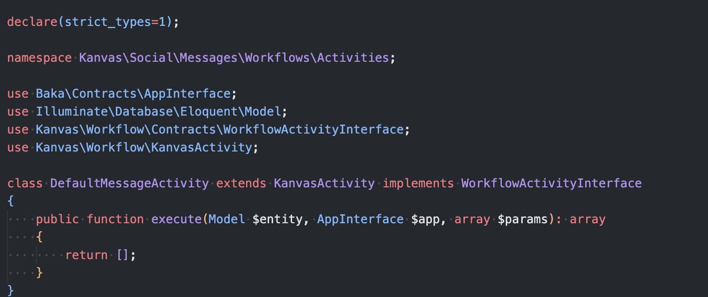
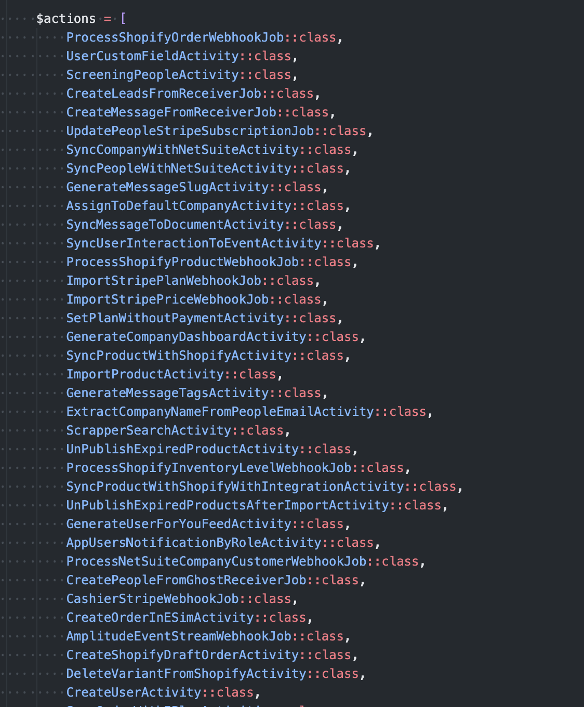

# Activities

Activities correspond to actions executed by workflows. Often they only do one action but sometimes an activity can do make a variety of actions. Actions can be anything; from sending an email to a new user after registering to optimizing an image when a large size image is sent.

## Creating your first Activity

The most basic template for an activity is the following:



## Registering you Activity

All activities are registered on the **KanvasWorkflowSynActionCommand** and are added to the actions list:



## Running the command to register the new activity in the Kanvas Database

Run the following command to sync the newly added activity with the Kanvas database:

```bash
php artisan kanvas:workflow-sync-actions
```