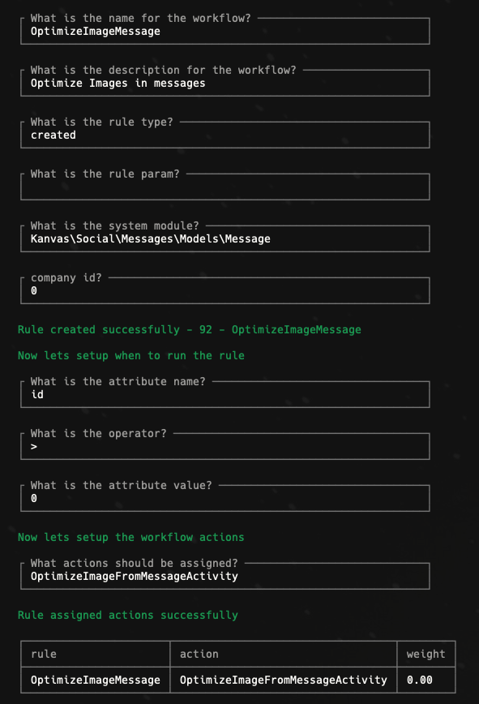

# Workflows

Workflows are series of activities that are triggered by specific conditions on the system and on an entity. For example: If a user has been registered on the system a workflow is triggered to send the new user a welcome email.

## Creating your first Workflow

To create a new workflow you just need to execute the command:

```bash
kanvas:create-workflow {app_id}
```

The command will walk you through a series of questions regarding the name, description, model of your workflow entity and the rules and actions associated with it for it to trigger.

