# Odoo Integration Architecture

> Architectural and integration guide for connecting **Odoo** (ERP/Accounting/Inventory/Purchase) to the **Kanvas Ecosystem Backend**, covering the **Product**, **Commerce**, **Accounting**, and **Souk (Marketplace)** domains.

- **Status:** Design reference — implementation-ready
- **Owner domain:** `src/Domains/Connectors/Odoo/`
- **Pattern:** Follows the standard [Kanvas Connector pattern](../.claude/skills/kanvas-connector/SKILL.md) (Handler + Client + DTO + Enums + Webhooks + Workflow Activities), mirroring the shape of existing ERP-style connectors such as `NetSuite`, `QuickBooks`, and `Acumatica`.
- **Transport:** Odoo **External API** — `JSON-RPC` (`/jsonrpc`) or `XML-RPC` (`/xmlrpc/2/common`, `/xmlrpc/2/object`), optionally proxied through Odoo's `web` REST-like endpoints if the `base_rest`/OCA REST module is installed.

---

## Table of Contents

1. [Integration Overview](#1-integration-overview)
2. [Connector Skeleton](#2-connector-skeleton)
3. [Product Domain](#3-product-domain)
4. [Commerce Domain](#4-commerce-domain)
5. [Accounting Domain](#5-accounting-domain)
6. [Souk Domain (Marketplace / Multi-Vendor)](#6-souk-domain-marketplacemulti-vendor)
7. [Cross-Domain Sync Orchestration](#7-cross-domain-sync-orchestration)
8. [Error Handling, Idempotency & Observability](#8-error-handling-idempotency--observability)
9. [Security & Credential Management](#9-security--credential-management)
10. [Best Practices Checklist](#10-best-practices-checklist)
11. [Appendix — Odoo RPC Call Reference](#11-appendix--odoo-rpc-call-reference)

---

## 1. Integration Overview

Odoo acts as the **system of record for ERP, inventory valuation, and accounting**, while Kanvas remains the **operational nervous system** — the source of truth for catalog authoring, customer experience, checkout, and marketplace orchestration. The integration is **bidirectional** but each domain has one authoritative direction per entity to avoid write conflicts.

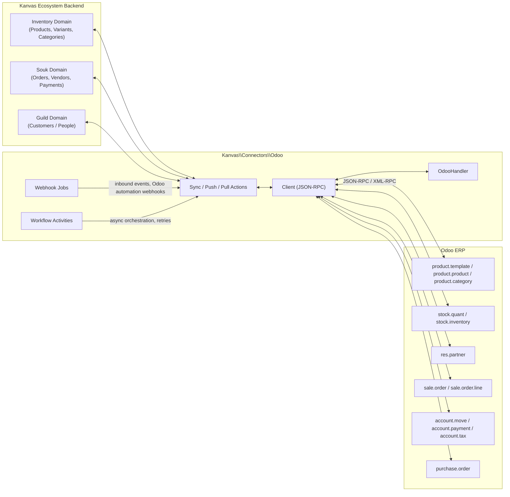

### Domain-to-Direction Matrix

| Domain | Kanvas Entity | Odoo Model | Source of Truth | Sync Trigger |
|---|---|---|---|---|
| Product | `Inventory\Products\Models\Products` | `product.template` | **Kanvas → Odoo** (catalog authored in Kanvas) | On product create/update, batch job |
| Product | `Inventory\Variants\Models\Variants` | `product.product` | **Kanvas → Odoo** | On variant create/update |
| Product | `Inventory\Categories\Models\Categories` | `product.category` | **Kanvas → Odoo** | On category create/update |
| Product | Stock levels | `stock.quant` / `stock.inventory` | **Odoo → Kanvas** (warehouse/ERP owns stock truth) | Webhook / scheduled pull, near real-time |
| Commerce | `Guild\Deals` / People (customer) | `res.partner` | **Kanvas → Odoo** | On customer create/update, first checkout |
| Commerce | `Souk\Orders\Models\Order` + `OrderItem` | `sale.order` + `sale.order.line` | **Kanvas → Odoo** | On checkout completion |
| Commerce | `OrderStatus` / `OrderStatusTransitions` | `sale.order.state` | **Bidirectional** (mapped) | Status transition webhook both ways |
| Accounting | Invoice | `account.move` (move_type=`out_invoice`) | **Odoo → Kanvas** (Odoo generates legal invoice) | On invoice creation/validation in Odoo |
| Accounting | Payment | `account.payment` | **Bidirectional** | Kanvas payment capture → Odoo reconciliation |
| Accounting | Tax | `account.tax` | **Odoo → Kanvas** (read-only reference data) | Scheduled pull / cache |
| Accounting | Refund / Credit Note | `account.move` (move_type=`out_refund`) | **Kanvas → Odoo** (refund initiated in Kanvas) | On refund action |
| Souk | Vendor/Merchant (`Companies`) | `res.partner` (`supplier_rank > 0`) | **Kanvas → Odoo** | On vendor onboarding/update |
| Souk | Split order per vendor (`OrderProvider`) | `purchase.order` (drop-ship) or analytic tag | **Kanvas → Odoo** | On multi-vendor order split |
| Souk | Commission | Analytic account / journal entry | **Kanvas → Odoo** | On commission settlement job |

---

## 2. Connector Skeleton

The Odoo connector follows the canonical shape documented in the `kanvas-connector` skill. All new code lives under:

```
src/Domains/Connectors/Odoo/
├── Handlers/
│   └── OdooHandler.php                 # extends BaseIntegration, validates + stores DB/UID/API key
├── Client.php                          # JSON-RPC transport, connection pooling per app/company
├── DataTransferObject/
│   ├── OdooCredentials.php
│   ├── OdooProductPayload.php
│   ├── OdooPartnerPayload.php
│   ├── OdooSalesOrderPayload.php
│   └── OdooInvoicePayload.php
├── Enums/
│   ├── ConfigurationEnum.php            # odoo_url, odoo_db, odoo_uid, odoo_api_key
│   ├── CustomFieldEnum.php              # ODOO_PRODUCT_ID, ODOO_PARTNER_ID, ODOO_ORDER_ID, ODOO_INVOICE_ID, ODOO_SUPPLIER_ID
│   ├── OdooOrderStateEnum.php
│   └── OdooModelEnum.php                # product.template, res.partner, sale.order, account.move, ...
├── Actions/
│   ├── Product/
│   │   ├── PushProductTemplateToOdooAction.php
│   │   ├── PushProductVariantToOdooAction.php
│   │   ├── PushProductCategoryToOdooAction.php
│   │   └── PullStockQuantFromOdooAction.php
│   ├── Commerce/
│   │   ├── SyncPartnerWithOdooAction.php
│   │   ├── PushSalesOrderToOdooAction.php
│   │   └── SyncOrderStatusWithOdooAction.php
│   ├── Accounting/
│   │   ├── PullInvoiceFromOdooAction.php
│   │   ├── RegisterOdooPaymentAction.php
│   │   ├── ReconcileOdooPaymentAction.php
│   │   └── CreateOdooCreditNoteAction.php
│   └── Souk/
│       ├── SyncVendorWithOdooSupplierAction.php
│       ├── SplitOrderIntoOdooPurchaseOrdersAction.php
│       └── CalculateVendorCommissionAction.php
├── Services/
│   └── OdooFieldMapperService.php       # shared field-mapping helpers (uom, currency, tax id lookups)
├── Webhooks/
│   └── ProcessOdooWebhookJob.php        # inbound: stock updates, invoice validation, payment reconciliation
└── Activities/
    ├── SyncProductToOdooActivity.php
    ├── PullStockFromOdooActivity.php
    ├── SyncSalesOrderToOdooActivity.php
    └── SyncInvoiceFromOdooActivity.php
```

### Handler

```php
<?php

declare(strict_types=1);

namespace Kanvas\Connectors\Odoo\Handlers;

use Kanvas\Connectors\Contracts\BaseIntegration;
use Kanvas\Connectors\Odoo\Client;
use Kanvas\Connectors\Odoo\Enums\ConfigurationEnum;
use Kanvas\Exceptions\ValidationException;
use Override;

class OdooHandler extends BaseIntegration
{
    #[Override]
    public function setup(): bool
    {
        $url = $this->data['odoo_url'] ?? null;
        $db = $this->data['odoo_db'] ?? null;
        $username = $this->data['odoo_username'] ?? null;
        $apiKey = $this->data['odoo_api_key'] ?? null;

        if (empty($url) || empty($db) || empty($username) || empty($apiKey)) {
            throw new ValidationException('Odoo URL, database, username and API key are required');
        }

        $this->company->set(ConfigurationEnum::BASE_URL->value, $url);
        $this->company->set(ConfigurationEnum::DATABASE->value, $db);
        $this->company->set(ConfigurationEnum::USERNAME->value, $username);
        $this->company->set(ConfigurationEnum::API_KEY->value, $apiKey);

        // authenticate() returns the Odoo internal uid, cached per company
        $uid = new Client($this->app, $this->company)->authenticate();
        $this->company->set(ConfigurationEnum::UID->value, (string) $uid);

        return $uid > 0;
    }
}
```

### Client (JSON-RPC transport)

Odoo's external API executes model methods through two generic endpoints:

- `common.authenticate(db, login, password/api_key, {})` → returns `uid`
- `object.execute_kw(db, uid, api_key, model, method, args, kwargs)` → executes any ORM method (`search`, `read`, `search_read`, `create`, `write`, `unlink`)

```php
<?php

declare(strict_types=1);

namespace Kanvas\Connectors\Odoo;

use Baka\Contracts\AppInterface;
use Baka\Contracts\CompanyInterface;
use GuzzleHttp\Client as GuzzleClient;
use Kanvas\Connectors\Odoo\Enums\ConfigurationEnum;
use Kanvas\Exceptions\ValidationException;

class Client
{
    protected GuzzleClient $client;
    protected string $database;
    protected string $apiKey;

    public function __construct(
        protected AppInterface $app,
        protected CompanyInterface $company,
    ) {
        $baseUrl = $this->company->get(ConfigurationEnum::BASE_URL->value);
        $this->database = (string) $this->company->get(ConfigurationEnum::DATABASE->value);
        $this->apiKey = (string) $this->company->get(ConfigurationEnum::API_KEY->value);

        if (empty($baseUrl) || empty($this->database) || empty($this->apiKey)) {
            throw new ValidationException('Odoo configuration is missing');
        }

        $this->client = new GuzzleClient([
            'base_uri' => $baseUrl,
            'headers' => ['Content-Type' => 'application/json'],
            'timeout' => 30,
        ]);
    }

    public function authenticate(): int
    {
        $username = (string) $this->company->get(ConfigurationEnum::USERNAME->value);

        $response = $this->call('common', 'authenticate', [
            $this->database,
            $username,
            $this->apiKey,
            [],
        ]);

        return (int) $response;
    }

    /**
     * Generic ORM call — mirrors `execute_kw`.
     *
     * @param array<mixed> $args   positional ORM args, e.g. [[['id', '=', 1]]]
     * @param array<mixed> $kwargs keyword args, e.g. ['fields' => ['name', 'list_price']]
     */
    public function executeKw(string $model, string $method, array $args = [], array $kwargs = []): mixed
    {
        $uid = (int) $this->company->get(ConfigurationEnum::UID->value);

        return $this->call('object', 'execute_kw', [
            $this->database,
            $uid,
            $this->apiKey,
            $model,
            $method,
            $args,
            $kwargs,
        ]);
    }

    protected function call(string $service, string $method, array $args): mixed
    {
        $response = $this->client->post('/jsonrpc', [
            'json' => [
                'jsonrpc' => '2.0',
                'method' => 'call',
                'params' => [
                    'service' => $service,
                    'method' => $method,
                    'args' => $args,
                ],
                'id' => (string) microtime(true),
            ],
        ]);

        $body = json_decode($response->getBody()->getContents(), true);

        if (isset($body['error'])) {
            throw new ValidationException(
                'Odoo RPC error: ' . ($body['error']['data']['message'] ?? $body['error']['message']),
            );
        }

        return $body['result'] ?? null;
    }
}
```

> **Octane note:** per the connector skill's static-cache rule, `Client` must **not** be cached as a singleton keyed by app/company id — always instantiate fresh so credential rotation is picked up immediately. The `uid` is safe to persist as a company custom field because it is re-derived on every `setup()`/re-auth call, not cached in a static PHP property.

### Configuration & Custom Field Enums

```php
enum ConfigurationEnum: string
{
    case BASE_URL = 'odoo_base_url';
    case DATABASE = 'odoo_db';
    case USERNAME = 'odoo_username';
    case API_KEY = 'odoo_api_key';
    case UID = 'odoo_uid';
    case DEFAULT_COMPANY_ID = 'odoo_company_id';   // Odoo multi-company id, when applicable
}

enum CustomFieldEnum: string
{
    case ODOO_PRODUCT_TEMPLATE_ID = 'ODOO_PRODUCT_TEMPLATE_ID';
    case ODOO_PRODUCT_VARIANT_ID = 'ODOO_PRODUCT_VARIANT_ID';
    case ODOO_CATEGORY_ID = 'ODOO_CATEGORY_ID';
    case ODOO_PARTNER_ID = 'ODOO_PARTNER_ID';
    case ODOO_SUPPLIER_ID = 'ODOO_SUPPLIER_ID';
    case ODOO_SALE_ORDER_ID = 'ODOO_SALE_ORDER_ID';
    case ODOO_INVOICE_ID = 'ODOO_INVOICE_ID';
    case ODOO_PAYMENT_ID = 'ODOO_PAYMENT_ID';
    case ODOO_PURCHASE_ORDER_ID = 'ODOO_PURCHASE_ORDER_ID';
}
```

Every Kanvas entity that has an Odoo counterpart stores the remote id as a **custom field** (`$model->set(CustomFieldEnum::ODOO_PRODUCT_TEMPLATE_ID->value, $odooId)`), never as a schema column — consistent with every other Kanvas connector. This keeps the mapping table implicit and queryable (`WHERE custom_fields->>'ODOO_PRODUCT_TEMPLATE_ID' = ?`) without a migration per connector.

---

## 3. Product Domain

### 3.1 Entity Mapping

| Kanvas Model | Odoo Model | Key Fields Mapped | Notes |
|---|---|---|---|
| `Inventory\Categories\Models\Categories` | `product.category` | `name` → `name`, `parent_category_id` → `parent_id` | Odoo categories are a tree via `parent_id`; sync parents before children |
| `Inventory\Products\Models\Products` | `product.template` | `name`, `description`, `sku` → `default_code`, `price` → `list_price`, `category` → `categ_id` | A Kanvas `Products` with no variants maps 1:1 to a `product.template` with a single auto-generated `product.product` |
| `Inventory\Variants\Models\Variants` | `product.product` | `sku` → `default_code`, `attributes` → `product.template.attribute.value`, `barcode`, `price` | Odoo variants are generated from `product.template.attribute.line`; Kanvas attribute combinations must map to Odoo attribute lines **before** variant creation |
| Stock (aggregated from `VariantsWarehouses`) | `stock.quant` (read) / `stock.inventory` (adjustments) | `warehouse` → `location_id`, `quantity` → `quantity` | Odoo is authoritative for on-hand stock; Kanvas warehouses map to Odoo `stock.location` |

### 3.2 Product Template & Variant Sync (Kanvas → Odoo)

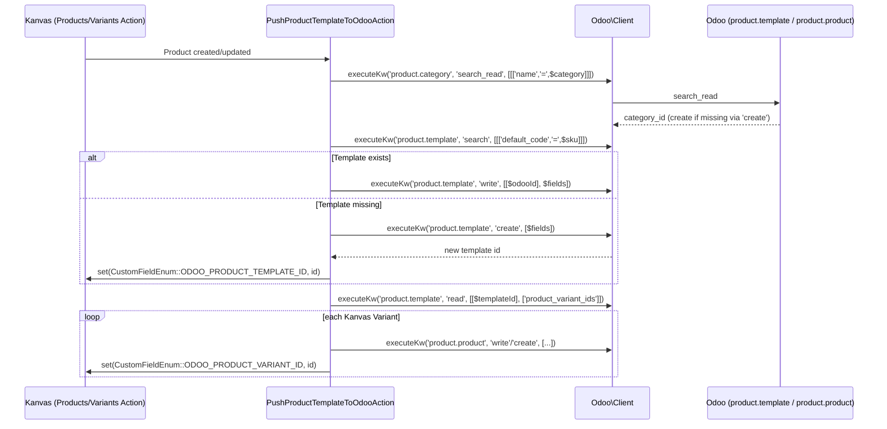

**Field mapping — `product.template`**

| Kanvas field | Odoo field | Transform |
|---|---|---|
| `name` | `name` | direct |
| `description` | `description_sale` | strip HTML if Kanvas stores rich text |
| `sku` | `default_code` | direct |
| `price` | `list_price` | currency-normalized to Odoo company currency |
| `category.name` | `categ_id` | resolved id, created lazily if missing |
| `is_published` | `sale_ok` / `active` | boolean map |
| `weight`, `dimensions` | `weight`, `volume` | unit-converted per Odoo `uom` settings |
| N/A | `type` | always `'consu'` (storable) unless a service SKU, then `'service'` |

**Field mapping — `product.product` (variant)**

| Kanvas field | Odoo field | Transform |
|---|---|---|
| `sku` | `default_code` | direct |
| `barcode` | `barcode` | direct |
| Kanvas attribute set (e.g. `Color=Red, Size=M`) | `product_template_attribute_value_ids` | requires pre-provisioning `product.attribute` + `product.attribute.value` + `product.template.attribute.line` on the template before variants can be written |
| `price` (variant override) | `lst_price` (extra variant price, delta from template) | Odoo variant pricing is a **delta**, not an absolute — compute `variant.price - template.price` |

> **Best practice:** Odoo auto-generates `product.product` rows when attribute lines are added to a `product.template`. Do **not** try to `create` a `product.product` directly for a templated variant set — instead, write the attribute lines on the template and then `read` the resulting `product_variant_ids`, matching them back to Kanvas variants by attribute-value combination, then `write` SKU/barcode/price deltas on each.

### 3.3 Category Sync

- Categories sync **top-down**: `PushProductCategoryToOdooAction` walks the Kanvas category tree from root to leaf so `parent_id` always resolves.
- Category matching key: `name` + `parent_id` composite (Odoo has no unique constraint on category name alone). Store `ODOO_CATEGORY_ID` on the Kanvas `Categories` model to skip repeat lookups.

### 3.4 Real-Time Stock Sync (Odoo → Kanvas)

Odoo is the authoritative source for **on-hand quantity**. Two supported mechanisms, in order of preference:

1. **Odoo Automated Action / Webhook (preferred, near real-time).** Configure an Odoo server action / automation rule on `stock.quant` (`write`/`create` trigger) that POSTs to Kanvas's inbound webhook endpoint whenever a quant's `quantity` or `reserved_quantity` changes for a tracked location.
2. **Scheduled Pull (fallback / reconciliation).** A Temporal workflow / scheduled command runs `PullStockQuantFromOdooAction` every N minutes as a safety net for missed webhooks and to backfill during connector downtime.

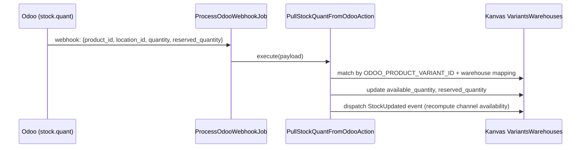

**Webhook payload contract (Odoo → Kanvas):**

```json
{
  "event": "stock.quant.updated",
  "model": "stock.quant",
  "record_id": 4821,
  "product_id": 1023,
  "location_id": 8,
  "quantity": 42.0,
  "reserved_quantity": 5.0,
  "company_id": 1,
  "timestamp": "2024-05-01T12:34:56Z"
}
```

- **Location → Warehouse mapping** is maintained as a config table on the connector (`odoo_location_id` custom field on `Inventory\Warehouses\Models\Warehouses`). A single Odoo location can map to at most one Kanvas warehouse.
- **Idempotency:** stock webhooks are `UPSERT`-style — always applied as an absolute `quantity` value from Odoo, never a delta, to avoid double-counting on retry/replay.
- **Negative stock guard:** if `quantity - reserved_quantity < 0`, clamp to zero at the Kanvas layer and emit a warning event rather than surfacing negative sellable stock on storefronts.

---

## 4. Commerce Domain

### 4.1 Customer Sync (`res.partner`)

| Kanvas Model | Odoo Model | Notes |
|---|---|---|
| `Guild\Deals` contact / People / `Companies` (as a customer) | `res.partner` | `customer_rank > 0` marks the partner as a customer in Odoo |

**Sync strategy:** lazy, on first checkout — `SyncPartnerWithOdooAction` runs as part of the checkout pipeline before `sale.order` creation, not as a pre-emptive bulk sync (keeps the partner list free of never-purchased leads).

**Field mapping**

| Kanvas field | Odoo field |
|---|---|
| `name` (first + last, or company name) | `name` |
| `email` | `email` |
| `phone` | `phone` / `mobile` |
| Billing address | `street`, `street2`, `city`, `zip`, `state_id`, `country_id` |
| Tax id / VAT | `vat` |
| N/A | `customer_rank = 1` |
| N/A | `company_type` (`'person'` or `'company'`) |

**Lookup key:** email is the primary match key (`search_read` on `res.partner` with `[['email', '=', $email]]`); fall back to `ODOO_PARTNER_ID` custom field once matched to avoid repeated `search_read` calls.

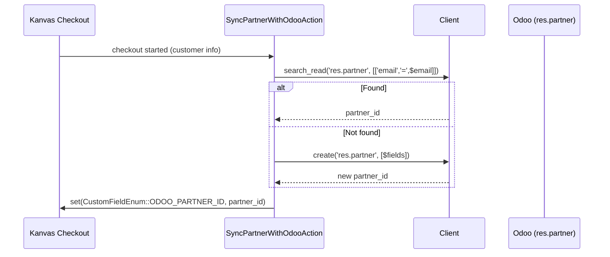

### 4.2 Sales Order & Sales Order Line Sync

`Souk\Orders\Models\Order` + `Souk\Orders\Models\OrderItem` → `sale.order` + `sale.order.line`, triggered on **checkout completion** (order status transitions into `pending`/`completed`, per `OrderStatusEnum`).

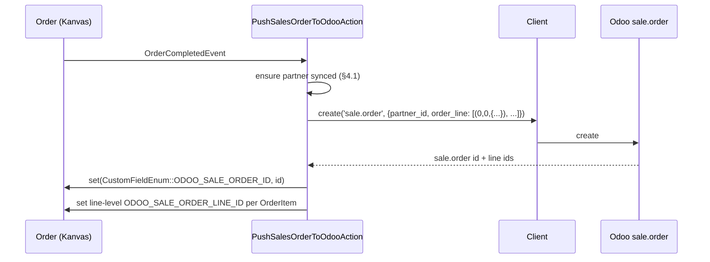

**`sale.order` field mapping**

| Kanvas (`Order`) | Odoo (`sale.order`) |
|---|---|
| `id` / `uuid` | `client_order_ref` |
| `customer` → partner | `partner_id` |
| `currency` | `currency_id` |
| `created_at` | `date_order` |
| `total_discount` | applied as line-level `discount` (%) — Odoo has no header discount by default |
| `shipping_address` | `partner_shipping_id` (separate `res.partner` child/address) |
| `billing_address` | `partner_invoice_id` |

**`sale.order.line` field mapping (per `OrderItem`)**

| Kanvas (`OrderItem`) | Odoo (`sale.order.line`) |
|---|---|
| `variant` (via `ODOO_PRODUCT_VARIANT_ID`) | `product_id` |
| `quantity` | `product_uom_qty` |
| `unit_price` | `price_unit` |
| `discount_percent` | `discount` |
| `tax` | `tax_id` (many2many ids, resolved via §5.3) |
| `name`/description override | `name` |

**Odoo Command tuple syntax** — `order_line` uses Odoo's ORM "commands" for one2many/many2many fields:

```php
$orderLines = $items->map(fn (OrderItem $item) => [
    0, 0, [
        'product_id' => $item->variant->get(CustomFieldEnum::ODOO_PRODUCT_VARIANT_ID->value),
        'product_uom_qty' => $item->quantity,
        'price_unit' => $item->unit_price,
        'discount' => $item->discount_percent,
        'tax_id' => [[6, 0, $resolvedTaxIds]],
    ],
])->toArray();
```

- `[0, 0, {values}]` → create a new line.
- `[1, id, {values}]` → update an existing line.
- `[2, id, 0]` → delete a line.
- `[6, 0, [ids]]` → replace a many2many field's full set of related ids.

Reference: [Odoo ORM API — relational field write syntax](https://www.odoo.com/documentation/17.0/developer/reference/backend/orm.html#odoo.models.Model.write).

### 4.3 Order Status Flow Mapping

Kanvas order lifecycle (`OrderStatusEnum` + `OrderFulfillmentStatusEnum`) and Odoo's `sale.order.state` / `invoice_status` are **not 1:1** — Kanvas must maintain an explicit mapping table rather than assuming string equality.

| Kanvas `OrderStatusEnum` | Kanvas `OrderFulfillmentStatusEnum` | Odoo `sale.order.state` | Direction | Trigger |
|---|---|---|---|---|
| `draft` | — | `draft` | Kanvas → Odoo | Cart saved / quote requested |
| `pending` | `pending` | `sent` or `sale` (confirmed) | Kanvas → Odoo | Checkout completed → `action_confirm()` |
| `completed` | `fulfilled` | `sale` + `done` (delivery) | Odoo → Kanvas | Odoo delivery (`stock.picking`) validated |
| `canceled` | `canceled` | `cancel` | Bidirectional | Either system cancels; propagate to the other |
| `failed` | — | *(no direct Odoo state — mapped to `cancel` + internal note)* | Kanvas-only | Payment failure before Odoo order exists |

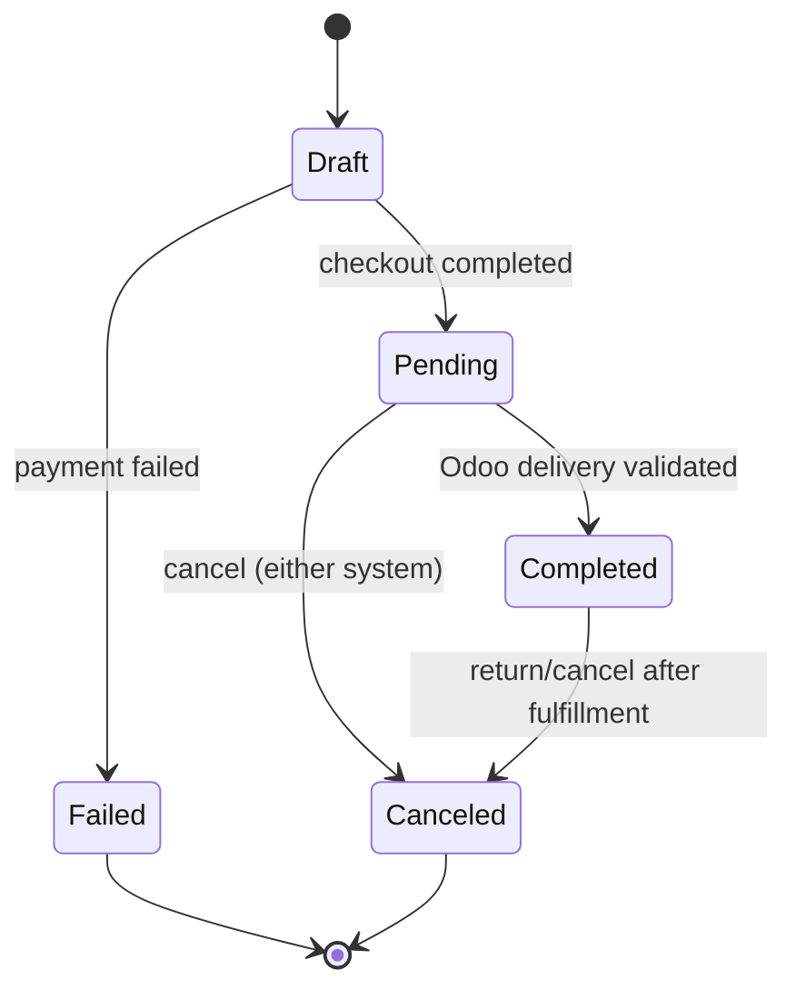

- `SyncOrderStatusWithOdooAction` is invoked from **both** directions:
  - Kanvas-originated transitions call `executeKw('sale.order', 'action_confirm' | 'action_cancel', [[$odooOrderId]])`.
  - Odoo-originated transitions (delivery validated, order canceled in Odoo backoffice) arrive via `ProcessOdooWebhookJob` and update `Order::status` + fire `OrderStatusTransitions` records for audit history, matching the existing `OrderTransitionHistory` model shape.
- **Conflict rule:** once an order is `completed` in Kanvas (fulfilled), Odoo cannot silently revert it — a reversal must go through an explicit return/refund flow (§5.4), never a raw status overwrite.

---

## 5. Accounting Domain

### 5.1 Customer Invoices (`account.move`)

Invoicing is **Odoo-authoritative** — Odoo generates the legal/fiscal document; Kanvas mirrors it for the customer-facing UI and payment reconciliation.

**Trigger:** invoice is created in Odoo either automatically (`sale.order.invoice_status = 'to invoice'` → `_create_invoices()`) or manually by finance ops; Kanvas pulls/receives via webhook and stores a read model.

**`account.move` mapping (header, `move_type = 'out_invoice'`)**

| Odoo field | Kanvas field | Notes |
|---|---|---|
| `id` | `ODOO_INVOICE_ID` custom field on `Order` | link back to source order via `invoice_origin` |
| `name` | `invoice_number` | Odoo sequence, e.g. `INV/2024/00042` |
| `partner_id` | resolved via `ODOO_PARTNER_ID` | |
| `invoice_date` | `issued_at` | |
| `amount_total` / `amount_untaxed` / `amount_tax` | `total`, `subtotal`, `tax_total` | |
| `state` (`draft`/`posted`/`cancel`) | `invoice_status` | only `posted` invoices are shown to customers |
| `payment_state` (`not_paid`/`in_payment`/`paid`/`partial`) | `payment_status` | drives Kanvas payment UI |

**`account.move.line` mapping (per invoice line)**

| Odoo field | Kanvas field |
|---|---|
| `product_id` | matched `OrderItem.variant` |
| `quantity` | `quantity` |
| `price_unit` | `unit_price` |
| `tax_ids` | `taxes[]` |
| `price_total` | `line_total` |

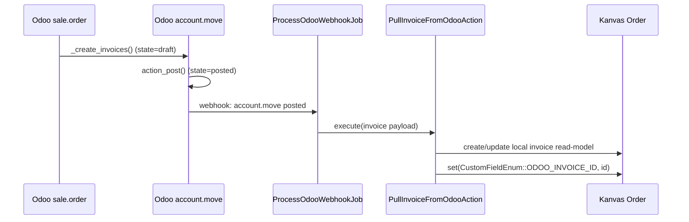

### 5.2 Payments (`account.payment`) & Reconciliation

Kanvas typically **captures payment first** (via Souk `Payments` providers — Stripe/PayWay/AuthorizeNet) then **registers** the corresponding payment in Odoo and reconciles it against the invoice.

```mermaid
sequenceDiagram
    participant P as Kanvas Payment Capture
    participant A as RegisterOdooPaymentAction
    participant C as Client
    participant AP as Odoo account.payment
    participant AM as Odoo account.move

    P->>A: PaymentCapturedEvent (order, amount, method)
    A->>C: executeKw('account.payment', 'create', [{
      partner_id, amount, payment_type: 'inbound',
      partner_type: 'customer', journal_id, payment_method_line_id
    }])
    C->>AP: create
    A->>C: executeKw('account.payment', 'action_post', [[payment_id]])
    A->>C: executeKw('account.move', 'js_assign_outstanding_line', [[invoice_id], payment_move_line_id])
    Note over A,AM: alternative: use account.move.line's reconcile() on matching move lines
    A->>P: set(ODOO_PAYMENT_ID), invoice.payment_status refresh
```

**`account.payment` field mapping**

| Kanvas field | Odoo field |
|---|---|
| `payment_method` (`stripe`, `payway`, ...) | `payment_method_line_id` (resolved journal payment method) |
| `amount` | `amount` |
| `currency` | `currency_id` |
| `transaction_id` (gateway reference) | `memo` / `ref` |
| N/A | `payment_type = 'inbound'`, `partner_type = 'customer'` |

**Reconciliation approaches (pick one, be consistent):**

1. **`action_post` + `js_assign_outstanding_line`** — programmatic equivalent of clicking "Reconcile" in the Odoo UI; simplest, works for full/partial payment against a single invoice.
2. **Manual move-line reconciliation** — `account.move.line.reconcile()` on `[receivable_line_id, payment_line_id]` when a payment must reconcile against **multiple** invoices (marketplace batch payout scenarios) or the payment predates the invoice.

**Partial payments:** Odoo's `payment_state` will report `in_payment`/`partial` — surface this directly on the Kanvas order rather than inferring it from amount math, since Odoo already accounts for currency rounding and multi-invoice allocation.

### 5.3 Taxes (`account.tax`)

Taxes are **reference data owned by Odoo** (accountants configure them per fiscal jurisdiction) and pulled into Kanvas read-only, cached with a short TTL.

- `PullOdooTaxesAction` runs `search_read('account.tax', [['type_tax_use', '=', 'sale']], ['name', 'amount', 'amount_type', 'id'])` on a schedule (e.g. daily) and on-demand cache-bust.
- Kanvas stores a lightweight `odoo_tax_id → { name, rate }` lookup table used purely to resolve `tax_id` when building `sale.order.line` / `account.move.line` payloads (§4.2, §5.1) — **Kanvas does not recompute tax amounts**; Odoo's tax engine is authoritative on the final invoice.
- Product-level tax defaults (`product.template.taxes_id`) should be respected: if a product already carries a default tax in Odoo, Kanvas only needs to pass an override when the order context requires one (e.g. tax-exempt customer).

### 5.4 Refunds / Credit Notes (`move_type = 'out_refund'`)

Refunds are **Kanvas-initiated** (customer service / self-service refund action) and pushed to Odoo as a credit note, not a raw invoice edit — Odoo invoices are immutable once posted.

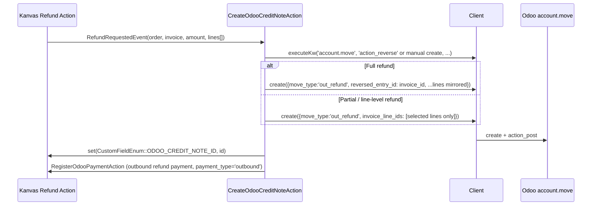

- **Full refund:** use Odoo's built-in reversal wizard equivalent — `account.move.reversal` create + `reverse_moves()` — which auto-mirrors every line with negated quantities and links `reversed_entry_id`.
- **Partial/line-level refund:** construct the `out_refund` move manually with only the refunded lines, keeping `invoice_origin` pointing at the original invoice.
- Once posted, register an **outbound** `account.payment` (`payment_type = 'outbound'`) to actually reconcile the refund against the credit note if money is physically returned; if it's store credit, do not create an `account.payment` — the credit note alone reduces the customer's `res.partner` balance.

---

## 6. Souk Domain (Marketplace / Multi-Vendor)

### 6.1 Vendor / Merchant Mapping

Souk marketplace sellers are `Companies` records participating as **stores** (see `Souk\Orders\Models\OrderProvider` pivot linking orders to providers). Each such company is synced to Odoo as a **supplier** (`res.partner` with `supplier_rank > 0`), enabling Odoo purchasing/AP workflows (drop-ship purchase orders, vendor bills, 1099-equivalent reporting).

| Kanvas | Odoo | Notes |
|---|---|---|
| `Companies` (Souk vendor/store) | `res.partner` | same partner model as customers; a company can be both `customer_rank > 0` and `supplier_rank > 0` if it also buys |
| Vendor bank/payout details | `res.partner.bank_ids` (`res.partner.bank`) | required for automated vendor payouts / vendor bills |
| Commission rate (`CommissionEnum`) | analytic tag / `res.partner` custom field or a dedicated `x_commission_rate` field | Odoo has no native marketplace-commission concept — model via analytic accounting (§6.3) |

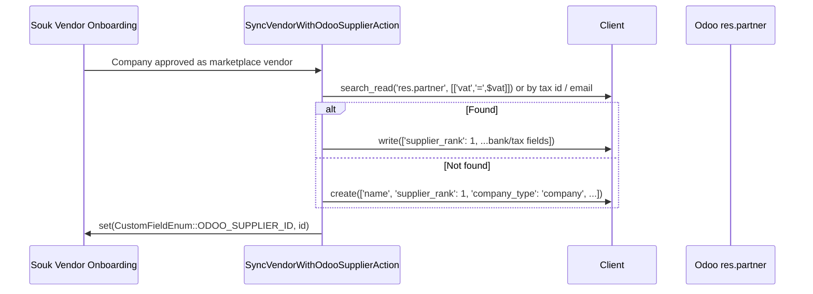

### 6.2 Multi-Vendor Split Orders & Consignment Flows

A single Kanvas checkout can span multiple vendors. `order_providers` (via `OrderProvider` pivot) already models the **order → vendor** split at the Kanvas layer; the connector's job is to project that split into Odoo's purchasing/inventory model.

Two supported patterns, chosen per marketplace operating model:

**A. Drop-ship purchase order per vendor** — Kanvas is the merchant of record; each vendor's split becomes a `purchase.order` that Odoo links to the originating `sale.order` line via `sale_line_id` (drop-ship routing: `route_id = 'Drop Ship'`).

**B. Consignment (vendor retains ownership until sale)** — inventory stays on the vendor's own `stock.location` (modeled as an Odoo multi-company / multi-warehouse setup, one warehouse per vendor); Kanvas only pushes a `sale.order` line referencing the vendor-owned variant, and Odoo's own delivery/valuation handles the ownership transfer at the accounting layer (via `stock.valuation.layer` + intercompany rules). Choose this pattern when vendors must see live inventory valuation in their own Odoo company.

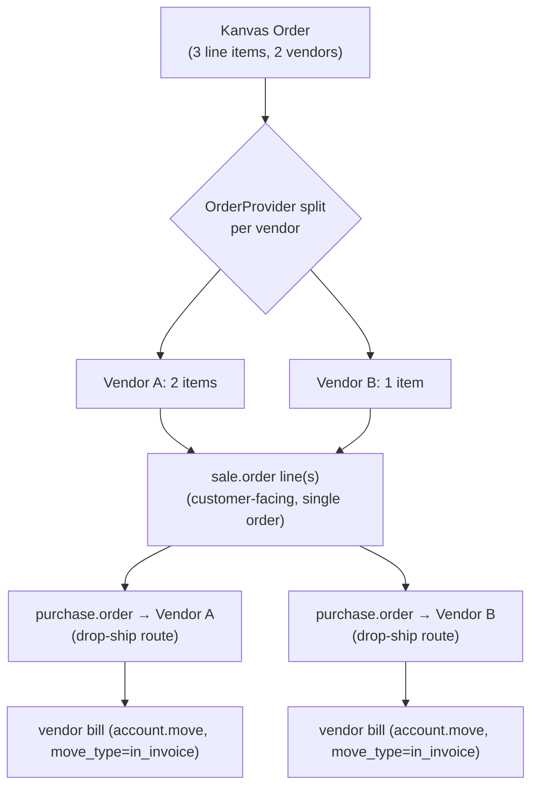

**`purchase.order` field mapping (per vendor split)**

| Kanvas | Odoo |
|---|---|
| `OrderProvider.company` (vendor) | `partner_id` |
| Split `OrderItem`s for that vendor | `order_line` (`purchase.order.line`), each carrying `sale_line_id` back-reference |
| Vendor's cost/wholesale price (not the customer-facing retail price) | `price_unit` |
| Parent `Order` | `origin` (free-text reference) |

`SplitOrderIntoOdooPurchaseOrdersAction`:

```php
$providers = $order->orderProviders; // OrderProvider pivot rows

foreach ($providers as $provider) {
    $lines = $order->items->where('provider_id', $provider->company_id);

    $poLines = $lines->map(fn (OrderItem $item) => [
        0, 0, [
            'product_id' => $item->variant->get(CustomFieldEnum::ODOO_PRODUCT_VARIANT_ID->value),
            'product_qty' => $item->quantity,
            'price_unit' => $item->vendor_cost, // NOT the retail price
            'sale_line_id' => $item->get(CustomFieldEnum::ODOO_SALE_ORDER_LINE_ID->value),
        ],
    ])->toArray();

    $poId = $client->executeKw('purchase.order', 'create', [[
        'partner_id' => $provider->company->get(CustomFieldEnum::ODOO_SUPPLIER_ID->value),
        'origin' => (string) $order->id,
        'order_line' => $poLines,
    ]]);

    $provider->set(CustomFieldEnum::ODOO_PURCHASE_ORDER_ID->value, $poId);
}
```

### 6.3 Commission Calculation & Analytic Accounting

Marketplace commission (Kanvas's `CommissionEnum::COMMISSION_RATE`) has no native Odoo object — model it with **Odoo analytic accounting**, which is purpose-built for cross-cutting cost/revenue attribution without touching the chart of accounts:

- Create one **analytic account** per vendor (`account.analytic.account`, linked to the vendor's `res.partner`).
- Tag every `sale.order.line` sold on behalf of that vendor with the vendor's `analytic_distribution` (Odoo 17+ field; `analytic_account_id` on older versions).
- Commission itself is realized as a **journal entry** (`account.move`, `move_type = 'entry'`) generated by `CalculateVendorCommissionAction` on a settlement cadence (e.g. weekly payout run):
  - Debit: Vendor payable clearing account, amount = commission withheld
  - Credit: Marketplace commission revenue account
  - Analytic line tagged to the vendor's analytic account for reporting

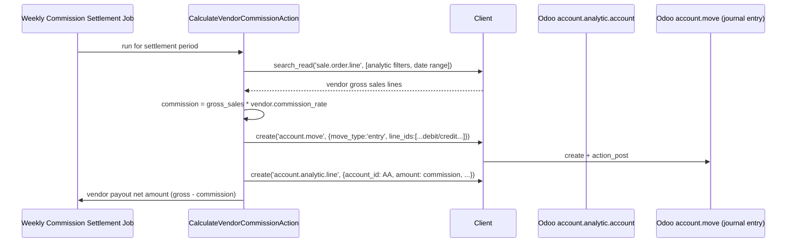

- **Reporting payoff:** with analytic accounts wired per vendor, Odoo's built-in analytic reports (P&L by analytic account) give finance a per-vendor revenue/commission breakdown with zero custom Odoo modules.
- **Payout amount** (gross minus commission minus any refunds in-period) is computed in Kanvas (source of order/refund truth) and only the **accounting entry** is pushed to Odoo — Kanvas remains the operational calculator, Odoo remains the ledger of record.

---

## 7. Cross-Domain Sync Orchestration

All sync operations are implemented as **Workflow Activities** (`Kanvas\Workflow\KanvasActivity`) so they inherit retry, backoff, and history logging for free, and are triggered from three sources:

| Trigger | Mechanism | Example |
|---|---|---|
| Kanvas domain event | `EventListener` → dispatch activity | `ProductUpdated` → `SyncProductToOdooActivity` |
| Odoo inbound webhook | `ProcessOdooWebhookJob` (extends `ProcessWebhookJob`) | stock quant change, invoice posted |
| Scheduled reconciliation | Laravel scheduled command → dispatch activity in bulk | nightly full stock reconciliation, tax cache refresh |

```php
class SyncProductToOdooActivity extends KanvasActivity
{
    public function execute(Products $product, Apps $app, array $params): array
    {
        return $this->executeIntegration(
            entity: $product,
            app: $app,
            integration: IntegrationsEnum::ODOO,
            additionalParams: $params,
            integrationOperation: function () use ($product) {
                return new PushProductTemplateToOdooAction($product)->execute();
            },
            company: $product->company,
        );
    }
}
```

- Every `executeIntegration()` call is recorded in `EntityIntegrationHistory` for auditing — no separate audit table needed for the Odoo connector.
- Register the connector's activities in `app/Console/Commands/Workflows/KanvasWorkflowSynActionCommand.php` and add `IntegrationsEnum::ODOO` per the connector skill checklist.

---

## 8. Error Handling, Idempotency & Observability

- **Idempotent writes:** every push action does a `search`/`search_read` match on a stable key (SKU, email, `client_order_ref`, `invoice_origin`) before `create`, and stores the resulting Odoo id as a custom field so subsequent syncs are `write`, not duplicate `create`.
- **Retry policy:** transient RPC failures (timeouts, `503`) retry with exponential backoff via the standard Workflow Activity retry policy; **validation errors from Odoo (e.g. missing required field, `UserError`) are not retried** — they surface immediately to `EntityIntegrationHistory` for manual triage.
- **Partial-batch failures:** when pushing a multi-line `sale.order` or `purchase.order`, prefer a **single Odoo `create` call with the full line set** over N+1 line-by-line calls — this makes the whole order creation atomic from Odoo's perspective (Odoo wraps the ORM call in a DB transaction) and avoids half-created orders.
- **Webhook replay safety:** inbound Odoo webhooks (stock, invoice, payment) must be safely replayable — always apply the payload as an **absolute state**, keyed by the Odoo record id + `write_date`, and ignore/skip if the local record's last-synced `write_date` is newer or equal (last-write-wins guard against out-of-order delivery).
- **Observability:** every action logs `odoo_model`, `odoo_id`, `method`, and `duration_ms` structured fields so Odoo RPC latency/error-rate is queryable independently of the surrounding business action.

---

## 9. Security & Credential Management

- Odoo credentials (`odoo_url`, `odoo_db`, `odoo_username`, `odoo_api_key`) are stored per **company** (not per app) via `$company->set()`, since each marketplace/company tenant may point at its own Odoo instance or Odoo company id.
- Use an Odoo **API key** (Settings → My Profile → API Keys), never the interactive login password — API keys are revocable independently and don't expire with SSO/password rotation.
- All outbound calls go through `Client`, instantiated fresh per call site (§2) — never cached statically — so a rotated API key takes effect on the very next request with no worker restart.
- Never log the raw `api_key` or full JSON-RPC request/response bodies containing it — log only `model`, `method`, and non-sensitive args.
- Any inbound Odoo webhook endpoint must verify a shared secret / signature header before invoking `ProcessOdooWebhookJob`, and must resolve `app`/`company` strictly from the authenticated receiver configuration — never from an unauthenticated payload field.

---

## 10. Best Practices Checklist

- [ ] Categories synced parent-first; leaf categories never created before their parent exists in Odoo
- [ ] Product variants provisioned via `product.template.attribute.line`, never direct `product.product.create` for attribute-based variants
- [ ] Stock is **pulled** from Odoo, never pushed from Kanvas — Kanvas never calls `stock.quant.write` to "correct" Odoo's number
- [ ] Every push action does a match-then-create-or-update, keyed by a stable business key, before writing
- [ ] `res.partner` sync is lazy (on first checkout / vendor onboarding), not a bulk pre-sync of every lead
- [ ] `sale.order.line` built with Odoo relational-field command tuples (`[0,0,{...}]` etc.), not raw arrays
- [ ] Tax amounts are **never recomputed in Kanvas** post-invoice — Odoo's tax engine is authoritative once an `account.move` is posted
- [ ] Refunds always create a **new** `out_refund` move — Kanvas never mutates a posted `account.move`
- [ ] Vendor commission modeled via analytic accounting, not ad-hoc custom fields on `res.partner`
- [ ] All Odoo remote ids stored as Kanvas custom fields (`Odoo\Enums\CustomFieldEnum`), never new DB columns
- [ ] All sync operations wrapped in Workflow Activities for retry/backoff/audit, registered in `IntegrationsEnum` + `KanvasWorkflowSynActionCommand`
- [ ] Credentials stored per-company via `$company->set()`, using Odoo API keys, never passwords
- [ ] Webhook payloads applied as absolute state with `write_date` guards, safely replayable

---

## 11. Appendix — Odoo RPC Call Reference

Quick reference for the ORM methods used throughout this guide, called via `Client::executeKw($model, $method, $args, $kwargs)`:

| Method | Purpose | Example |
|---|---|---|
| `search` | Return matching record ids | `executeKw('res.partner', 'search', [[['email', '=', 'a@b.com']]])` |
| `search_read` | Search + read fields in one call (preferred over `search` + `read`) | `executeKw('product.template', 'search_read', [[['default_code','=','SKU-1']], ['id','list_price']])` |
| `read` | Read fields for known ids | `executeKw('sale.order', 'read', [[42], ['state','amount_total']])` |
| `create` | Create a new record | `executeKw('res.partner', 'create', [[{...}]])` |
| `write` | Update existing record(s) | `executeKw('product.template', 'write', [[[10], {...}]])` |
| `unlink` | Delete record(s) (avoid — prefer `active=False` archiving) | `executeKw('product.template', 'unlink', [[[10]]])` |
| `action_confirm` | Confirm a `sale.order` (draft/sent → sale) | `executeKw('sale.order', 'action_confirm', [[[42]]])` |
| `action_post` | Post a draft `account.move` / `account.payment` | `executeKw('account.move', 'action_post', [[[99]]])` |
| `action_reverse` / `account.move.reversal` | Create a credit note from a posted invoice | see §5.4 |
| `js_assign_outstanding_line` | Reconcile a payment against an invoice | see §5.2 |

**Endpoint summary:**

| Endpoint | Protocol | Use |
|---|---|---|
| `/jsonrpc` | JSON-RPC 2.0 | Preferred — used by `Client` throughout this guide |
| `/xmlrpc/2/common` | XML-RPC | `authenticate`, `version` |
| `/xmlrpc/2/object` | XML-RPC | `execute_kw` equivalent |
| `/web/dataset/call_kw` | Odoo's internal web endpoint | **Not used** — requires session cookie auth, not suited for server-to-server integration |

Official reference: [Odoo External API documentation](https://www.odoo.com/documentation/17.0/developer/reference/external_api.html).
